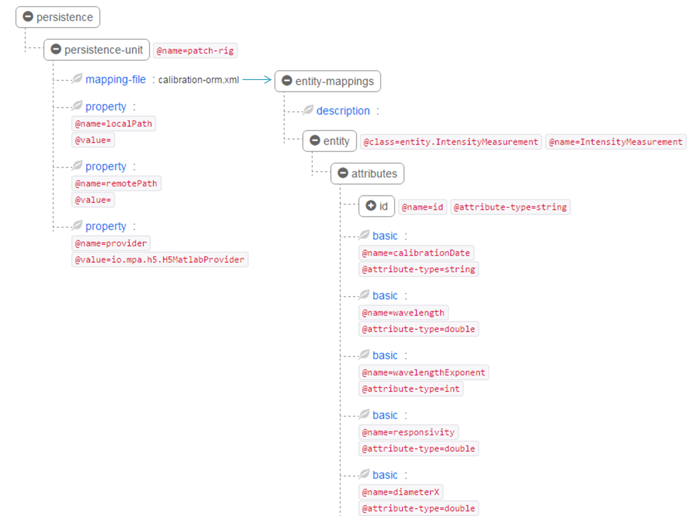

# Matlab Persistence

(In Development)

The Matlab Persistence is used for managing data between Matlab objects / structures across multiple file formats (HDF5, Excel, CSV)

It tries to mimic [Java Persistence API](http://openjpa.apache.org/builds/1.2.3/apache-openjpa/docs/jpa_overview_arch.html) functionality.